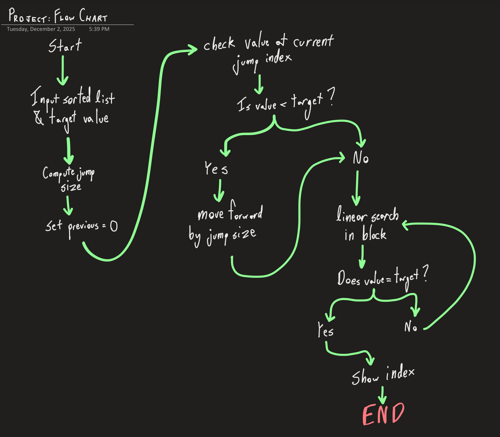

# CISC-121-Project-Deliverables
## Chosen Algorithm & Why: 
I have chosen Jump Search as my algorithm to visualize since I believe that it is a unique, yet not too complex algorithm. The jumping pattern ans final linear scan are pretty easy to represent visually, making the two phases of the algorithm simple to understand. This visualization will also help explain time complexity in a better way than just "the big O," by showing how Jump Search reduces the number of comparisons compared to linear search.

## Computational Thinking:
### Decomposition 
The algorithm is Divided into 3 main steps: determining the jump size based off of the array length, then jumping forward through the list in intervals, identifying the block where the target might exist, and then performing a linear search within that block to find the exact value.
### Pattern Recognition
The algorithm follows a repeating pattern of jumping forward by a fixed amount and then compares the values with the target. Once the jump passes the target value, it switches to checking each element one by one within the last block until the value is found or the block ends.
### Abstraction
The visualization will show only the important actions: the current position, the jump points, and the active search range. Compared values are highlighted, and the block being searched will be clearly marked. Calculations in the code such as the math inbetween indexes and the square root calculations are not going to be shown, I want to keep the display simple and more focused on the algorithms behavior, not the internal processes of the algorithm.
### Algorithm Design
The user will input a list of integers and a target value through the GUI. Then, it will process the input by running the jump search algorithm and visually displaying each jump and comparison step. The output will then show where the value was found and it's position, along with some visual feedback that highlights the search process.



## BEFORE Adding Interactivity - Where AI Has Been Used:
### Debugging
#### Before (Buggy Version)
```python
import math
import random

numbers = [4,8,14,19,20,22,24,27,30,55]
target = list[random.randint(0,9)]  
# Bug: "list" is the built-in type, not my array
print("Target value is: ", target)

def jump(list,target):
    # Bug: parameter name "list" overwrites Python's built in list type
    # I should call it something like "lst" or "arr"
    n = len(list)
    step = math.sqrt(n)
    # Bug: step should be an integer (use int(math.sqrt(n)))
    previous = 0
    # jump phase
    while previous < n and list[math.floor(step)] < target:
        # Bug: Index can go out of range.
        # Bug: math.floor(step) is unnecessary if step is already an int
        previous = int(step)
        step += math.sqrt(n)
        # Bug: step must remain an integer.
        if previous >= n:
            return -1
    # linear search phase
    while previous < n and list[math.floor(step)] < target:
        # Bug: Should check list[previous], not list[math.floor(step)].
        # Linear search must move one-by-one from previous
        previous += 1
    # check if found
    if list[previous] == target:
        # Bug: No bounds check (previous may be out of range)
    return -1

pos = jump(numbers, target)
if numbers != -1:
    # Bug: This checks the entire list instead of the result
    print("Found at position: ", pos)
else:
    print("Number not found at any position.")

```
At this point I had finished my code, but there were bugs that I couldn't find. So, I used AI (ChatGPT) with the prompt: "Identify the bugs in this code and walk me through how to fix them, but don't explicity give away how to fix it, I still need to undetstand what's going on: (code)"

#### After (Fixed, Non-Buggy Version)
```python
import math
import random

numbers = [
    random.randint(1,10), 
    random.randint(11,20), 
    random.randint(21,30),
    random.randint(31,40), 
    random.randint(41,50), 
    random.randint(51,60),
    random.randint(61,70), 
    random.randint(71,80), 
    random.randint(81,90),
    random.randint(91,100)
]
# FIX: Numbers are generated in increasing ranges to help ensure order
numbers.sort()
# ADDED: Sorting to guarantee jump search always works
print("Given list is:", numbers)
target = int(input("Choose a number from the list to search for: "))
# FIX: User now selects a real value instead of random index guessing
while target not in numbers:
    # ADDED: Input validation to guarantee the number exists in the list
    target = int(input("Choose a number FROM THE LIST: "))
print("Target value is:", target)
def jump(lst, target):
    # FIX: Renamed parameter from "list" to "lst" to avoid overriding built-in name.
    n = len(lst)
    step = int(math.sqrt(n))
    # FIX: step is now an integer
    previous = 0
    # jump phase
    while previous < n and lst[min(step, n) - 1] < target:
        # FIX: Corrected index check formatting
        # FIX: Prevents index out of bounds
        # FIX: Now compares correct jump location
        previous = step
        step += int(math.sqrt(n))
        # FIX: step increases by integer jump size
        if previous >= n:
            return -1
    # linear search
    while previous < n and lst[previous] < target:
        # FIX: Proper linear scan forwards
        previous += 1
    # found
    if previous < n and lst[previous] == target:
        # FIX: Bound check added before comparison
        return previous
    return -1

pos = jump(numbers, target)
if pos != -1:
    # FIX: Correct check now uses the result index, not the list
    print("Found at position:", pos + 1)
else:
    print("Number not found.")

```
## AFTER Adding Interactivity - Where AI Has Been Used:
I had ChatGPT walk me through the main ways that Gradio worked. Although this time around I did end up taking advantage of being allowed to use AI Level 4, so what I did here was ask it how to add buttons, how to customize colours, how to animate the search, and how to use button imputs. At some points if I was confused enough I just allowed it to complete that task itself, but I think it's fine since we never really had a unit on Gradio/HTML/CSS. I did learn a bit of it in highschool, but most of my knowledge has washed up since then, so most of the stuff that ChatGPT has generated for me, I understand, but I wouldn't have been able to come up with that myself in the moment. The prompts I used were the following:

- "How do I install Gradio to this code, if it's not just by typing something like 'install gradio as gr' then tell me where to install this."
- "Walk me through how buttons work and how I can implement them into my code."
- "Walk me through colour styling. Is it just like CSS, or are there any differences?"
- "Walk me through how I can animate this search algorithm into an animation."
- "If there is anywhere where the code can be more efficient, implement new efficient ways and comment where it has been done."

The new parts of the code compared to my original code without any Gradio styling have been commented in the code below.

```python
import gradio as gr  # ADDED: GUI library
import math
import random
import time  # ADDED: for slowing down animations

numbers = []  # Global list to store numbers
log_text = ""  # Global variable to store step-by-step explanations

# -----------------------------
# Generate a new sorted list
# -----------------------------
def generate_numbers():
    global numbers, log_text
    numbers = [
        random.randint(1,10), random.randint(11,20), random.randint(21,30),
        random.randint(31,40), random.randint(41,50), random.randint(51,60),
        random.randint(61,70), random.randint(71,80), random.randint(81,90),
        random.randint(91,100)
    ]
    numbers.sort()  # ADDED: sort to guarantee jump search works
    log_text = ""  # Reset step log
    return render_list(), log_text, 0  # Reset number input to 0

# -----------------------------
# Render the list with highlights
# -----------------------------
def render_list(current_index=None, bad=False):
    """Render the numbers as HTML boxes. Highlight current_index in yellow, or flash red for invalid input."""
    html = """
    <div style='display:flex; gap:6px; justify-content:center; padding:12px; background-color:#111; border-radius:6px;'>
    """
    for i, num in enumerate(numbers):
        color = "#2a2a2a"  # Normal dark gray
        if bad:
            color = "#8b1e1e"  # Red for invalid number
        if i == current_index:
            color = "#ffe066"  # Yellow for current step
        html += f"""
        <div style='width:42px; height:42px; line-height:42px; text-align:center; 
                    border:1px solid #444; background:{color}; color:white; 
                    font-family:Arial; font-size:14px; border-radius:4px;'>{num}</div>
        """
    html += "</div>"
    return html

# -----------------------------
# Flash red animation for invalid input
# -----------------------------
def flash_invalid():
    """Flash the list red if the user inputs a number not in the list."""
    global log_text
    log_text = "Your number is not in the list. Try again.\n"
    yield render_list(bad=True), log_text
    time.sleep(0.8)
    yield render_list(), log_text  # Return to normal view

# -----------------------------
# Jump search with animation
# -----------------------------
def jump_search(target):
    global log_text

    # -----------------------------
    # Input validation
    # -----------------------------
    if not isinstance(target, (int, float)) or target not in numbers:
        for frame in flash_invalid():  # Flash red if invalid
            yield frame
        return

    log_text = ""  # Reset log for new search
    n = len(numbers)
    step = int(math.sqrt(n))  # Jump size
    prev = 0

    log_text += f"We will jump {step} steps each time to find the number.\n"

    # -----------------------------
    # Jump phase
    # -----------------------------
    while prev < n:
        next_index = min(step, n) - 1  # Calculate jump index
        log_text += f"Jumping to index {next_index} which has the number {numbers[next_index]}.\n"
        yield render_list(next_index), log_text  # Highlight jump
        time.sleep(0.9)  # Slower jump for visualization

        if numbers[next_index] == target:  # STOP if we land on the number
            log_text += f"We landed on the number! Found it at index {next_index}.\n"
            yield render_list(next_index), log_text
            return

        if numbers[next_index] > target:  # Jumped past the target, move to linear search
            log_text += f"The number we jumped to is bigger than our target. We will check each number step by step now.\n"
            break

        prev = step
        step += int(math.sqrt(n))  # Next jump

    # -----------------------------
    # Linear search phase
    # -----------------------------
    log_text += f"Checking each number one by one starting from index {prev}.\n"
    while prev < n and numbers[prev] < target:
        log_text += f"Checking index {prev}, it is {numbers[prev]}, not our number.\n"
        yield render_list(prev), log_text
        time.sleep(0.8)  # Slow linear check
        prev += 1

    # -----------------------------
    # Final check
    # -----------------------------
    if prev < n and numbers[prev] == target:
        log_text += f"Found our number at index {prev}!\n"
        yield render_list(prev), log_text
    else:
        log_text += "We reached the end and did not find the number.\n"
        yield render_list(), log_text

# -----------------------------
# Gradio interface
# -----------------------------
with gr.Blocks() as demo:
    list_display = gr.HTML()  # Shows the number array
    target = gr.Number(precision=0)  # Input for number to search
    run = gr.Button("Run")  # Run search
    regen = gr.Button("New List")  # Generate new numbers
    log = gr.Textbox(lines=10)  # Step-by-step log

    # Button connections
    regen.click(generate_numbers, outputs=[list_display, log, target])
    run.click(jump_search, inputs=target, outputs=[list_display, log])
    demo.load(generate_numbers, outputs=[list_display, log, target])  # Initialize on load

demo.launch()  # Launch Gradio app
```
## Steps to Run
Visit: https://huggingface.co/spaces/teddyprins/CISC121-Final-Project
## Testing and Verification
#### 1. Edge Cases

#### 2. Making sure results are correct
#### 3. Example Runs
